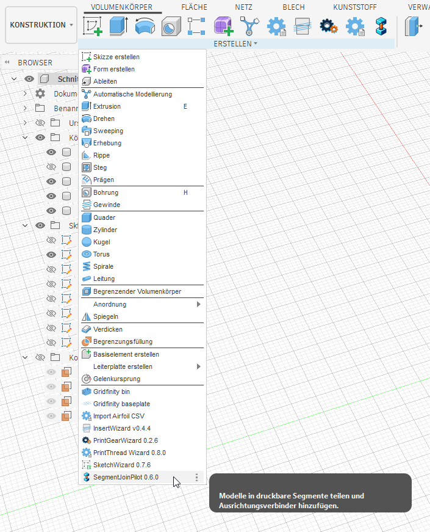
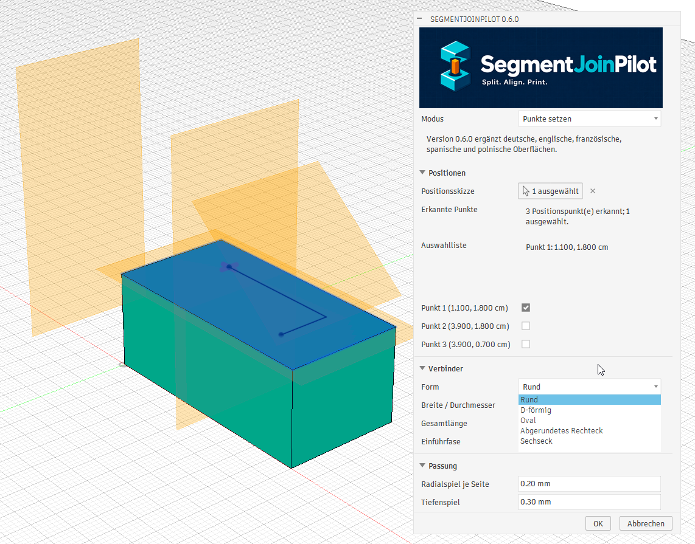
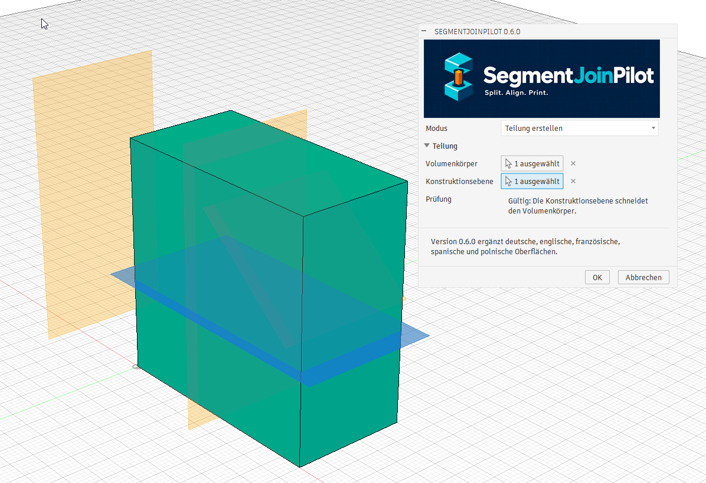
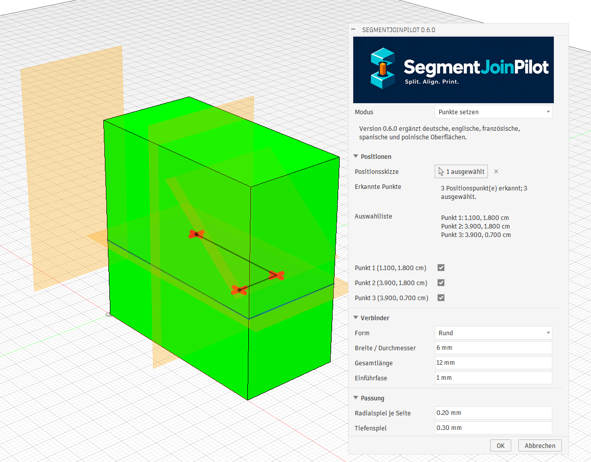
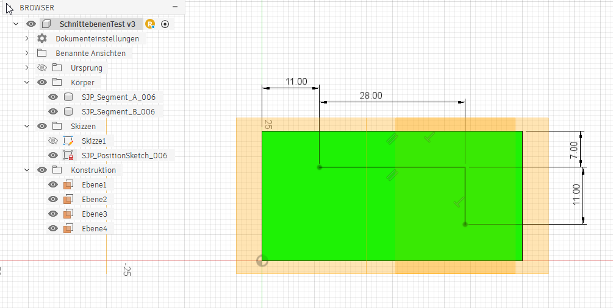
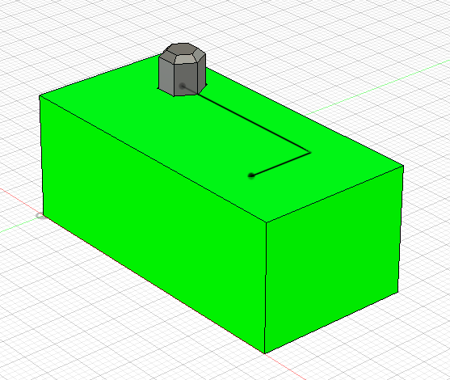
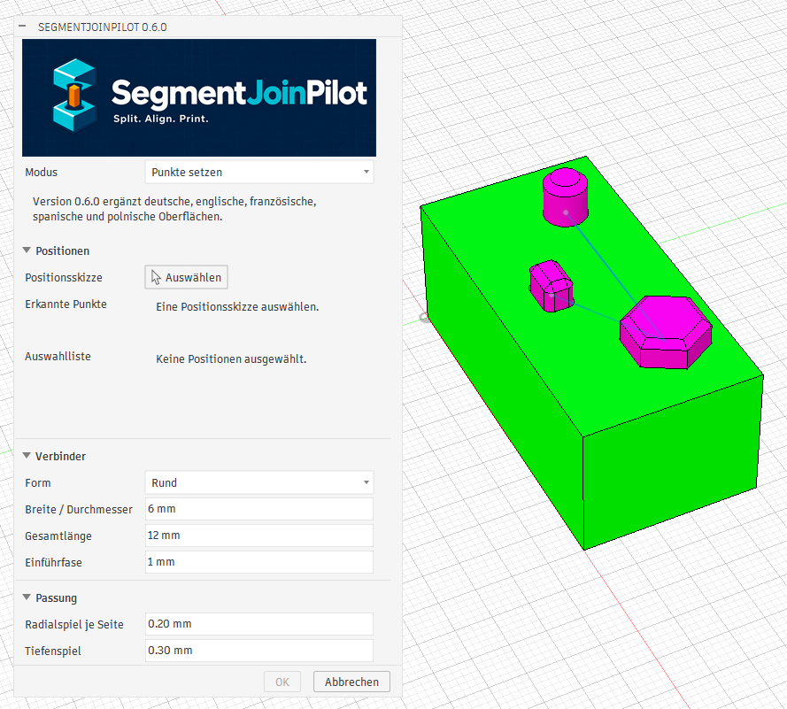

<p align="center">
  
</p>

<p align="center">
  <strong>English</strong> | <a href="README-DE.md">Deutsch</a>
</p>

# SegmentJoinPilot

SegmentJoinPilot is an open-source Autodesk Fusion add-in for splitting large 3D models into printable segments and creating matching alignment connectors at user-defined positions.

The add-in is intended for makers, educators, model builders, and FDM users who need to divide models because of build-volume limits, print orientation, maintenance, assembly, or surface-quality requirements.

## New in version 0.7.2

The round variants are now named **RoundConical15** and **RoundConical30**. New **HexConical15** and **HexConical30** variants taper toward both ends at fixed −15° and −30° angles. Hexagon size is specified across flats at the section. Both ends retain at least 50% of that width; matching sockets include radial and depth clearance. No additional lead-in chamfer is applied.

## New in version 0.7.1

**Conical15** and **Conical30** taper from the section toward both ends at fixed −15° and −30° angles. The diameter is measured at the section. Matching sockets include radial and depth clearance. Length validation preserves at least 50% of the initial diameter at both connector ends for a 3D-printing contact surface (25% of the original circular area). It also prevents sockets including depth clearance from reaching zero radius. The warning states the maximum total length. These shapes have no additional lead-in chamfer.

## Know-How-Schmiede

The [Know-How-Schmiede website](https://know-how-schmiede.de/) provides practical knowledge, projects, and tools covering CAD, programming, 3D printing, and model building.

The [Know-How-Schmiede YouTube channel](https://www.youtube.com/channel/UCuEKsFW7ojVm20DLiC_2V2g) also features many tutorial videos about Autodesk Fusion 360, 3D design, and 3D printing.

> Project status: Planning / initial development

## Planned workflow

1. Create or select a construction plane at the desired split position.
2. Select the solid body that should be divided.
3. Let SegmentJoinPilot split the body into separate segments.
4. Place sketch points on the generated section face.
5. Select the connector shape, dimensions, insertion depth, clearance, and lead-in.
6. Generate matching sockets in both segments and retain the connectors as separate bodies.
7. Keep all generated features organized and named in the Fusion timeline.

## Version 0.6.0 in action

Version 0.6.0 automatically follows the Fusion UI language and provides English, German, French, Spanish, and Polish interfaces.

| Add-in and split operation | Position selection and shapes |
| --- | --- |
|  |  |
|  |  |
|  |  |



## Planned connector shapes

- Round
- D-shaped
- Oval
- Rectangular with rounded corners
- Hexagonal

Additional connector types may be added after the core workflow is stable.

## Planned features

- Split one solid body with a selected construction plane
- Support multiple connector positions per section face
- FDM-oriented fit presets and custom clearance
- Symmetric or asymmetric insertion depths
- Chamfered or tapered lead-ins
- Separate connector bodies
- Matching pockets on both sides of the split
- Live preview before committing changes
- Consistent names for bodies, sketches, and features
- A dedicated timeline group for each operation
- Validation of wall thickness, connector spacing, and invalid geometry
- Multi-plane and multi-segment processing in a later release

## Initial FDM clearance presets

Clearance is defined per side. A round 8.0 mm connector with 0.20 mm clearance per side therefore produces an 8.4 mm socket.

| Preset | Clearance per side | Total dimensional difference | Intended use |
|---|---:|---:|---|
| Press fit | 0.05–0.10 mm | 0.10–0.20 mm | Calibrated printers and test coupons |
| Tight | 0.10–0.15 mm | 0.20–0.30 mm | Accurate FDM prints |
| Standard | 0.20 mm | 0.40 mm | Recommended default |
| Loose | 0.25–0.30 mm | 0.50–0.60 mm | Easy assembly or larger parts |
| Custom | User defined | Calculated | Material- and printer-specific settings |

These values are starting points, not universal guarantees. Printer calibration, material, layer height, orientation, and connector size all affect the final fit.

## Repository structure

```text
SegmentJoinPilot/
├── README.md
├── README-DE.md
├── LICENSE
├── doku/
├── fusion_addin/
├── images/
└── installer/
```

## Installation

On Windows, close Autodesk Fusion and run `SegmentJoinPilot-Setup-0.6.2.exe`. The installer detects existing directories under **Autodesk Fusion** and **Autodesk Fusion 360** and lets you review and change the destination. No administrator rights are required.

See the [installation and troubleshooting guide (German)](doku/INSTALLATION.md) for the Windows installer, manual installation, and macOS. **The macOS instructions are untested because no Mac is available.** Installer build instructions are in [`installer/README.md`](installer/README.md).

## Development principles

- Use the Autodesk Fusion API and Python.
- Keep geometry generation separate from command-dialog and Fusion API code where practical.
- Store dimensions internally in a consistent unit system and convert explicitly at API boundaries.
- Validate selections and geometry before creating permanent features.
- Avoid relying on unstable face or body indices.
- Store add-in metadata with Fusion attributes so generated operations can be identified later.
- Keep the first release focused on one body, one split plane, and multiple connectors.

## Contributing

The project is in its planning stage. Bug reports, test models, fit-test results, documentation corrections, and focused feature proposals will be welcome once the initial implementation is published.

## Trademark notice

Autodesk and Fusion are trademarks or registered trademarks of Autodesk, Inc. SegmentJoinPilot is an independent project and is not affiliated with or endorsed by Autodesk, Inc.

## License

SegmentJoinPilot is released under the MIT License. The complete license text is available in the [LICENSE](LICENSE) file in the repository root.
